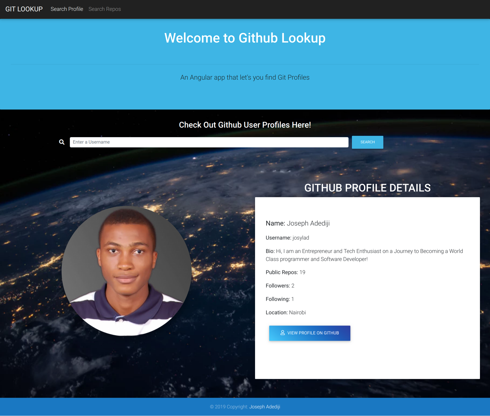

# Github Lookup
#### An Angular app that let's you find Git Profiles and Repositories, 22/08/2019
### **This project was done using ANGULAR-Cli Version 8.**

## Description
This is a **Github Lookup** application that searches for user and displays their profile info using the ***Github API.***

This is a website where users may enter a GitHub username into a form, submit it, and see names and descriptions of that person's public repositories.

GitHub API was used to retrieve this information. This API allows ***5,000*** requests per hour with an API key, but only 60 requests per hour _without_ one.

## User Story

- Users can enter Github user info info a form and submit it.

- Users can see names and descriptions of person's public repositories.

- Users can make up to 5000 requests per hour due to Github-API integration.

# Prerequisites

To work with Github Lookup you need to have some few prerequisites.

This include the following mentioned below.


- Node.js

- Angular-JS framework

- Watchman

- Typescript

- Terminal

If you dont have this requirements you could use the link above to help with the installation guide.

## Screenshot


## Deployment/Demo
App was deployed to [Github Pages](https://josylad.github.io/Git-Lookup/) using Angular Cli, by publishing the **dist/** folder.
https://josylad.github.io/Git-Lookup/

# **SETUP/INSTALLATION.**

### **To work With Github Lookup**

1. You will need Internet connection.

2. You will also need a Webpage URL to load in URL's:

3. To get to use **GIT-LOOKUP** fist you need to get to the Github-API-Search--Update-Angular-cli-8 repository.

Link:-> ```https://github.com/josylad/Git-Lookup```

4. From there you can access Git-Lookup.

5. **Clone** the project.

6. Once you done with cloning and project is on your device.

7. get into project folder (cd into project).

8. On your **bash** terminal Run the command:-

```
ng serve
```

9. Open your preferred **web browser** and load it on local host:

```
http://localhost:4200/
```

10. This will load for you Github Lookup


## Known Bugs
No known bugs at the moment.
## Author
Joseph Adediji  
https://twitter.com/josylad

## Technologies used
* HTML
* CSS
* Angular
* Bootstrap
* Angular CLI
* Type Script

## Support and Contact

-Twitter: [@Josylad](https://twitter.com/josylad/)

-github-username: josylad

## License
This project is licensed under the MIT License - see the [LICENSE](LICENSE) file for details
Copyright (c) 2019
